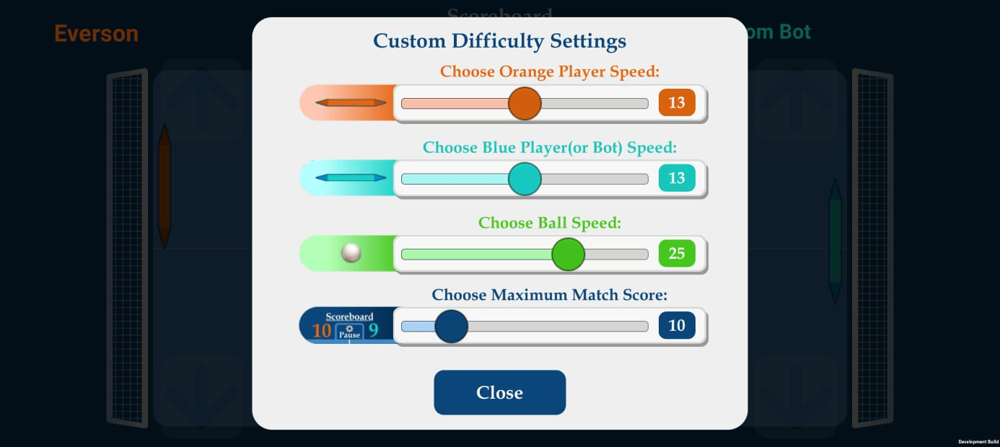

# Ping Pong 2D - Unity Android Mobile Game

## Project Overview
This is a modern, fast-paced 2D arcade game built with **Unity**. It features a polished mobile experience with local multiplayer, adjustable physics, and an AI opponent. Developed as a practical application of my studies at **CSJ Academy**, this project showcases my ability to bridge the gap between **Graphic Design** and **C# Game Programming**.

## Tech Stack & Tools
- **Engine:** Unity 2022+
- **Language:** C# (C-Sharp)
- **UI/UX Design:** Corel Draw / Unity UI Toolkit
- **Platform:** Android (APK)
- **Architecture:** State-based Game Loops & Singleton Patterns
- **AI:** Custom paddle logic for single-player challenge

## Key Features
- **Dual Game Modes:** Play against a smart AI Bot or challenge a friend on the same device.
- **Custom Match Engine:** Full control over P1/P2 paddles, ball speed, and score limits.
- **Mobile Optimized:** Intuitive touch controls designed with a "UX-first" approach.
- **Dynamic Audio:** Built-in music control system for real-time background audio management.
- **Professional UI:** Sleek, graphic-designer-grade interface and transitions.

## Project Status (Work in Progress)
This project is currently in **Version 2.9**. 
- [x] Core Physics & Gameplay
- [x] Local Multiplayer & AI Bot
- [x] Customization Menu
- [x] Music Control System
- [ ] Game Tutorial
- [ ] Game Credits
- [ ] Google Play Store Integration (Planned)

## Download & Play
You can download the latest build (v2.9) for Android to test the gameplay here:
[**Download APK From Releases Page**](https://github.com/eversoneder/Ping-Pong-Android-2D/releases/tag/v2.9)

## Contact
For any queries or collaboration opportunities, please contact me at:
everson_spinola@hotmail.com
